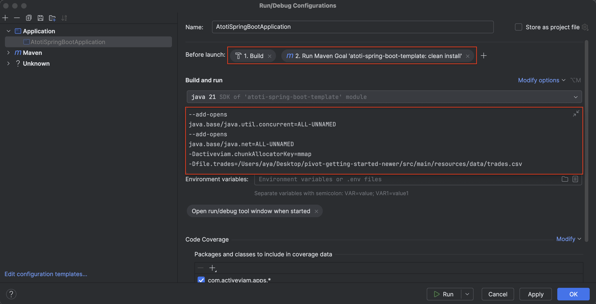

<p align="center">
  
</p>
<h1 align="center">Atoti Spring Boot Template</h1>
<p align="center">A minimalist Atoti project built with Spring Boot for you to edit, customize and use as a base for your Atoti Java projects.</p>

---

## 📋 Details

This project aims to be an example of how to run Atoti as a [Spring Boot](https://spring.io/guides/gs/spring-boot)
application. Atoti was already a *Spring* application, but with the power of *Spring Boot* we can simplify our
dependency management, deployment model, and many other goodies that come with Spring Boot.

This project is a starting point for your own projects and implementations. You should be able to take this, customize
it and get a cube up and running in a few minutes.

## 📦 Installation

#### Requirements

- Java 21
- Maven 3
- Atoti jar files (commercial software)
- Running the application requires a license for the Atoti software.

First, clone or download this repository.

Make sure to set your artifactory credentials in the maven `settings.xml`:

```xml
<servers>
    <server>
        <id>ActiveViamInternalRepository</id>
        <username>aya</username>
        <password>API_TOKEN</password>
    </server>
</servers>
```

Then, run `mvn clean install`. This will generate a jar file in the `target` folder, which can be run using
standard java commands.

**Note:** If your build is unsuccessful, try skipping tests: `mvn clean install -DskipTests`

## 💻 Usage

### Running the fat jar

The project contains, out of the box, an extremely simple datastore schema and small `trades.csv` file. You can find
this file in `src/main/resources/data`.<br>

### Running on macOS

Add the following
argument `-Dactiveviam.chunkAllocatorKey=mmap` to your JVM, so it then becomes:

```bash
java -Dactiveviam.chunkAllocatorKey=mmap -Dfile.trades=<absolute path of trades.csv> -jar <absolute path of fat jar path>
```

**Note:** If unable to start the Atoti Spring Boot application, you may need to add some additional VM arguments as
well, try the following:

```bash
java --add-opens java.base/java.util.concurrent=ALL-UNNAMED --add-opens java.base/java.net=ALL-UNNAMED -Dactiveviam.chunkAllocatorKey=mmap -Dfile.trades=<absolute path of trades.csv> -jar <absolute path of fat jar path>
```

### Running from the IDE

We provide two run configurations: `AtotiSpringBootApplication` and `AtotiSpringBootApplicationOTEL` for IntelliJ.

### Spring Boot Developer Tools

For development purposes, we recommend using the `spring-boot-devtools` module to enable [automatic restart](https://docs.spring.io/spring-boot/docs/1.5.16.RELEASE/reference/html/using-boot-devtools.html#using-boot-devtools-restart).

Add the following to the `pom.xml`:

```xml
<dependencies>
    <dependency>
        <groupId>org.springframework.boot</groupId>
        <artifactId>spring-boot-devtools</artifactId>
        <optional>true</optional>
    </dependency>
</dependencies>
```

Create a run configuration with the following `Before launch` tasks and VM options:



Notice that we've refrained from invoking `java -jar` in our VM options when setting our IDE run configuration. This is because of the following note in the [Spring Boot docs](https://docs.spring.io/spring-boot/docs/1.5.16.RELEASE/reference/html/using-boot-devtools.html#using-boot-devtools):

> 💡 **Note:** Developer tools are automatically disabled when running a fully packaged application. If your application is launched using `java -jar` or if it’s started using a special classloader, then it is considered a “production application”. Flagging the dependency as optional in Maven or using compileOnly in Gradle is a best practice that prevents devtools from being transitively applied to other modules using your project.

Now when we modify our .java files and save them, our application will automatically restart and reflect the changes.


### Visualizing Datastore Schema

First, let's add the following dependency to our `pom.xml`:

💡 **Note:** Make sure to stop and re-run to rebuild the project. Automatic restart will not reflect the newly added dependency!

```xml
    <dependency>
      <groupId>com.activeviam.tech</groupId>
      <artifactId>datastore-schema-printer</artifactId>
      <version>6.1.0</version>
      <scope>compile</scope>
    </dependency>
```

Then, in `src/main/java/com/activeviam/apps/cfg/source/InitialCsvLoad.java`, we can add the following:

```java
    @EventListener(value = ApplicationReadyEvent.class)
    void onApplicationReady() {
      log.info("ApplicationReadyEvent triggered");
      initialLoad();
      showDatastoreSchema();
    }

    public void showDatastoreSchema() {
        new JungSchemaPrinter(false).print("Training datastore", datastore);
    }
```

As well as amend `src/main/java/com/activeviam/apps/AtotiSpringBootApplication.java`:

```java
public class AtotiSpringBootApplication {
    public static void main(String[] args) {
        //        SpringApplication.run(AtotiSpringBootApplication.class, args);
        var application = new SpringApplication(AtotiSpringBootApplication.class);
        // this is useful if we want to display the data store schema in the awt window
        application.setHeadless(false);
        application.run(args);
    }
}
```

We can now visualize the schema of our datastores.


### Connecting to the Atoti Server

- Excel: you can connect to the cube from Excel, by connecting to an 'Analysis Services' source. The default URL to use
  when running locally is `http://localhost:9090/xmla`

- AtotiUI, ActiveViam's user interface for exploring the cube, will be available from `http://localhost:9090/ui`

- List of REST endpoints provided can be found at `http://localhost:9090/swagger-ui/index.html`

The default security credentials are `admin:admin`, but can be modified in the `application.yml` file.<br>
For a real production deployment you should probably use LDAP instead of hardcoding the users in the `application.yml` file.<br>
It is also recommended that you change the JWT key pair in `application.yml` by running the class `JwtUtil` and
generating a new key pair.

## ❤️ Using OpenTelemetry

Check [this section for OpenTelemetry](./otel/doc/STACK.md).
