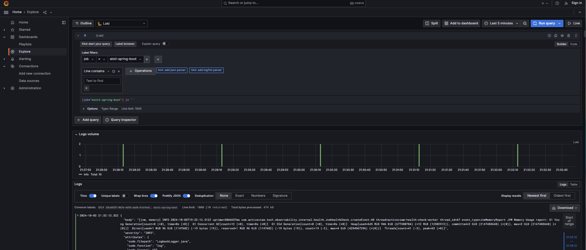

## Logs

### Configuration

I'm using logback for the logging, see the configuration here: `src/main/resources/logback-spring.xml`.<br>
The logs are pushed to the collector thanks to this appender, check the details in the links section:

```xml
  <!-- Appender to send the logs to OpenTelemetry -->
<appender name="OpenTelemetry"
          class="io.opentelemetry.instrumentation.logback.appender.v1_0.OpenTelemetryAppender">
  <captureExperimentalAttributes>true</captureExperimentalAttributes>
  <captureCodeAttributes>true</captureCodeAttributes>
  <captureMarkerAttribute>true</captureMarkerAttribute>
  <captureMdcAttributes>*</captureMdcAttributes>
</appender>
```

### How to observe

I export the logs from the collector to Loki, this is how we can query them, make sure you select the right `job`, this
is the `service.name` we used in `-Dotel.resource.attributes=service.name=atoti-spring-boot,service.version=1.0`.<br>
Note that you can turn on `Prettify JSON`:



### Links

- [https://opentelemetry.io/docs/instrumentation/java/manual/#logs](https://opentelemetry.io/docs/instrumentation/java/manual/#logs)
- [https://opentelemetry.io/docs/specs/otel/logs/](https://opentelemetry.io/docs/specs/otel/logs/)
- [https://github.com/open-telemetry/opentelemetry-java-instrumentation/tree/main/instrumentation/logback/logback-appender-1.0/library](https://github.com/open-telemetry/opentelemetry-java-instrumentation/tree/main/instrumentation/logback/logback-appender-1.0/library)

