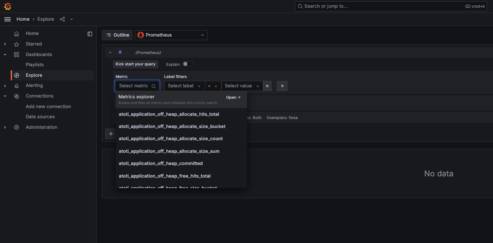
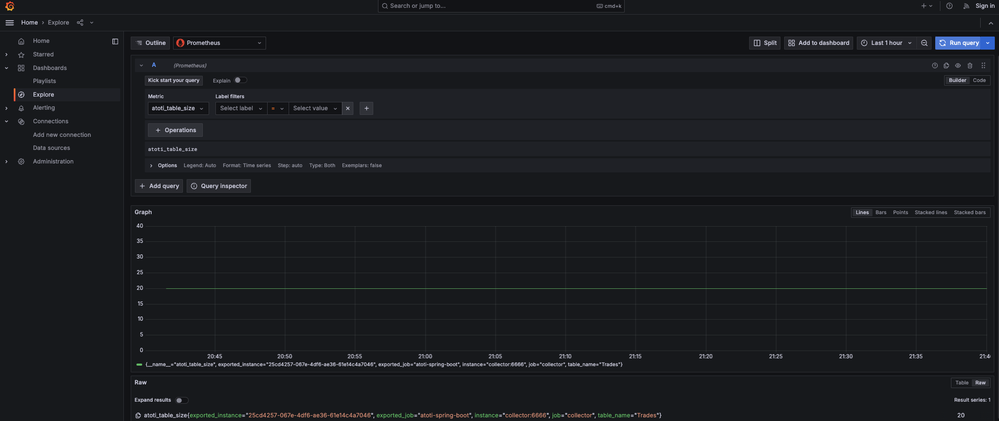

## Metrics

### How to observe

You can also use grafana `http://localhost:3000`, click on Explore, then choose Prometheus, click on the metrics explorer to see all the metrics:

You can choose one and observe it:

