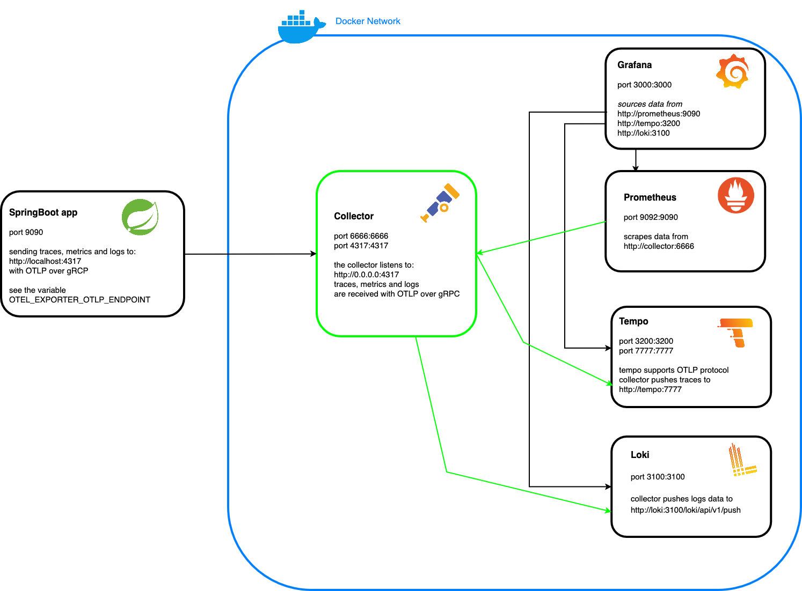

## The OTEL stack



### Run

We assume that you know how to use Docker and that Docker is installed on your machine,
see [https://www.docker.com/products/docker-desktop/](https://www.docker.com/products/docker-desktop/).<br>
Run `docker compose up -d` from the folder `otel/otel-stack`. This will start the whole environment defined in the schema
above.

### Configuration

The `docker-compose.yaml` located under `otel/otel-stack` is the file having the configuration of all the
containers that you can see in the schema above.<br>
Note that thanks to the OpenTelemetry collector, the SpringBoot app should not be aware of all the observability tools.
The SpringBoot app will send the traces, metrics and logs to the collector on the default port `4317` with the OTLP (
OpenTelemetry protocol) over gRCP.<br>

The SpringBoot app should start with some environment variables, so it can reach the OpenTelemetry collector:

```bash
export OTEL_TRACES_EXPORTER=otlp
export OTEL_METRICS_EXPORTER=otlp
export OTEL_LOGS_EXPORTER=otlp
export OTEL_EXPORTER_OTLP_PROTOCOL=grpc
export OTEL_EXPORTER_OTLP_ENDPOINT=http://localhost:4317 # default endpoint, use the port defined for gRPC
export OTEL_TRACES_SAMPLER=always_on # collects all traces regardless of the sampling rate
export OTEL_METRIC_EXPORT_INTERVAL=1000
export OTEL_RESOURCE_ATTRIBUTES=service.name=atoti-spring-boot,service.version=1.0
```

Those environment variables can be used as jvm args too in case you start the application from the IDE, note that the `AtotiSpringBootApplicationOTEL` launcher is provided for the IntelliJ users:

```
-Dotel.traces.exporter=otlp
-Dotel.metrics.exporter=otlp
-Dotel.logs.exporter=otlp
-Dotel.exporter.otlp.protocol=grpc
-Dotel.exporter.otlp.endpoint=http://localhost:4317
-Dotel.traces.sampler=always_on
-Dotel.metric.export.interval=1000
-Dotel.resource.attributes=service.name=atoti-spring-boot,service.version=1.0
-javaagent:./otel/otel-agent/opentelemetry-javaagent.jar
```

Those are telling your application where is the collector is (http://localhost:4317), what are we sending to the
collector (traces, logs and metrics) and how (OTLP).

We start the application with the OpenTelemetry java
agent, [https://github.com/open-telemetry/opentelemetry-java-instrumentation](https://github.com/open-telemetry/opentelemetry-java-instrumentation):

```
This project provides a Java agent JAR that can be attached to any Java 8+ application and dynamically injects bytecode to capture telemetry from a number of popular libraries and frameworks.<br>
You can export the telemetry data in a variety of formats. You can also configure the agent and exporter via command line arguments or environment variables.<br>
The net result is the ability to gather telemetry data from a Java application without code changes.
```

This agent provides a standardized approach to instrumenting the SpringBoot application.<br>

Let's check how the collector is configured:


In our case the collector we are using is based on this
image: `otel/opentelemetry-collector-contrib` [https://github.com/open-telemetry/opentelemetry-collector-contrib](https://github.com/open-telemetry/opentelemetry-collector-contrib),
the configuration of the collector is located in this file `otel/otel-stack/collector-config-local.yaml`.<br>
As you say in the schema above, we need to define the `receivers`, the source of the collector, in my case this is the
SpringBoot app which sends the traces, logs and metrics with OTLP over gRCP.<br>
The received traces, logs and metrics are exported to different tools:

- The traces are exported to Tempo (with OTLP).
- The logs are exported to Loki (push to an endpoint).
- We DO NOT push the metrics to Prometheus, the collector provides an endpoint to Prometheus and every 15 seconds
  Prometheus scrapes the metrics.

Note that we can have more than one application sending information to the collector.<br>
You can use any tools compatible with OpenTelemetry, you need for that to amend the `collector-config-local.yaml` file.

### Traces

[Traces](./TRACES.md)

### Metrics

[Metrics](./METRICS.md)

### Logs

[Logs](./LOGS.md)

### Links

- [https://opentelemetry.io/docs/collector/](https://opentelemetry.io/docs/collector/)
- [https://github.com/open-telemetry/opentelemetry-java/blob/main/sdk-extensions/autoconfigure/README.md#exporters](https://github.com/open-telemetry/opentelemetry-java/blob/main/sdk-extensions/autoconfigure/README.md#exporters)
- [https://github.com/open-telemetry/opentelemetry-java-examples](https://github.com/open-telemetry/opentelemetry-java-examples)
- [https://opentelemetry.io/ecosystem/vendors/](https://opentelemetry.io/ecosystem/vendors/)
- [https://opentelemetry.io/docs/concepts/sdk-configuration/otlp-exporter-configuration/](https://opentelemetry.io/docs/concepts/sdk-configuration/otlp-exporter-configuration/)
- [https://opentelemetry.io/docs/collector/scaling/](https://opentelemetry.io/docs/collector/scaling/)
