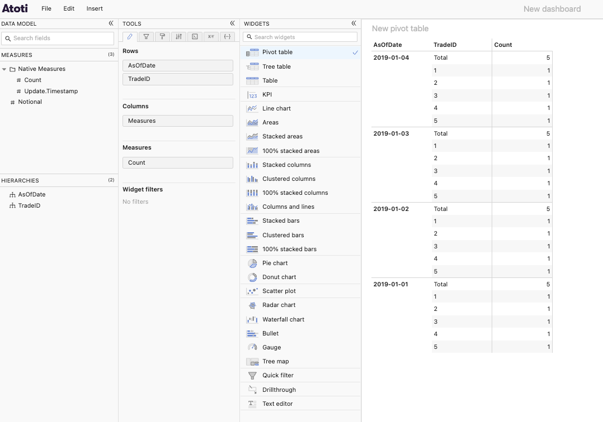
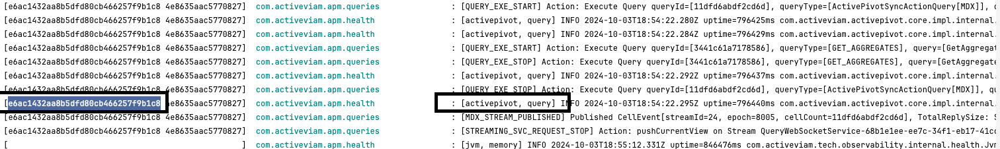
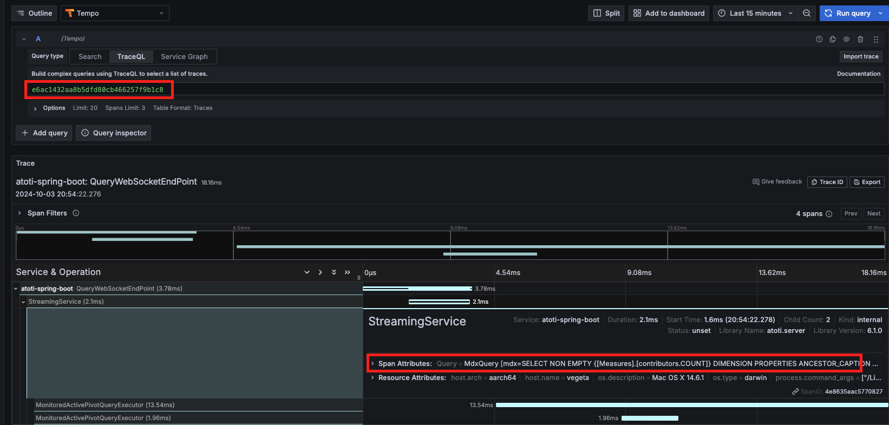

## Traces

### How to observe

The SpringBoot app and the stack should be both running. 
Run a query from the UI: 

Check the logs and pickup one traceId, pick a trace related to a query log (_[activepivot, query]_): 

Connect to Grafana and use Tempo in order to query that traceId. 
Go to `http://localhost:3000/`, then search for that trace: 
